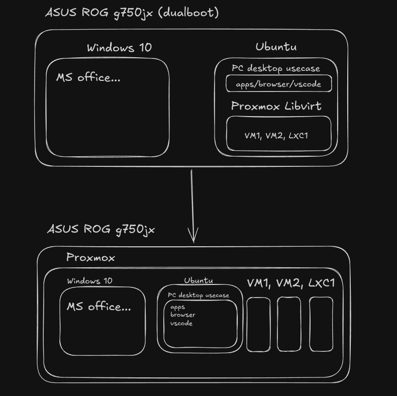

# History

How this repo got to its current shape — the physical-hardware migration
that eliminated nesting from the cluster, and the flat-layout → modules
refactor that shaped the current `modules/` + `environments/` split. See
[../README.md](../README.md) for the current state and
[architecture.md](architecture.md) for why it's built this way.

## From a dual-boot laptop to two bare-metal cluster nodes

The diagram above is the shape of the migration this lab has been through,
one node at a time:

- **Before:** the ASUS ROG G750JX dual-boots Windows 10 (for MS Office
  etc.) and Ubuntu. Ubuntu runs Proxmox nested inside libvirt/KVM, and
  *that* nested Proxmox hosts `VM1`, `VM2`, `LXC1`. Two layers of
  virtualization stacked on top of a dual-boot split — this was
  `pve-rog`'s actual state for a good part of this project's life (see
  `scripts/install-proxmox-with-libvirt.sh` and the nested-era entries in
  [troubleshooting.md](troubleshooting.md), e.g.
  [`br0`/`enp4s0` reattachment](troubleshooting.md#br0-loses-its-physical-nic-attachment-after-a-nested-vm-teardownhost-reboot)
  and [`vnet0` reattachment](troubleshooting.md#vnet0-the-nested-vms-own-libvirt-bridge-port-doesnt-reattach-to-br0-automatically-after-a-hard-power-loss)).
- **After:** Proxmox runs directly on the bare metal. Windows 10 and
  Ubuntu both become ordinary sibling guest VMs on it, alongside whatever
  else the host runs (`VM1`, `VM2`, `LXC1` in the diagram — in this repo's
  terms, the rest of `pve-rog`'s guests: `prod`/`stage`/`dev` nodes,
  `poly-nodes`, etc.).

This repo reached that "after" state via `environments/workstation` — a
GUI-installed Ubuntu Desktop VM on bare-metal `pve-rog`, viewed through a
local SPICE kiosk (`vga_type = "qxl2"`, GPU passthrough deliberately
rejected for that Kepler card). That environment was later **removed from
this repo** (see the log entry below): the desktop-VM work — including the
Windows 10 half that was the planned next step — moved to a dedicated repo,
[`proxmox-hosted-workstation`](../../proxmox-hosted-workstation), which
takes the opposite approach on different hardware (`bare-pve` + a
desktop-class GTX 950, real whole-device GPU + USB-controller passthrough
via `proxmox_hardware_mapping_pci`, output straight to physical monitors).

## `pve-rog`: nested Proxmox → bare metal, and the cluster rename

`pve-rog` (`.20`) started life as a nested Proxmox instance on the
G750JX — running inside libvirt/KVM on that laptop's host OS — while
waiting on a second physical machine. Once `bare-pve` (`.30`, dedicated
hardware) was acquired, the justification for nesting went away, and
`pve-rog` was rebuilt onto its own bare-metal install. Both cluster nodes
are now real hardware; there is no longer a nested/virtualized layer
anywhere in the cluster itself.

At the same time, the cluster was renamed from `lab-cluster` to
`nexus-cluster`, and the bare-metal node (`.30`) from `pve` to `bare-pve`
— mostly for clarity now that neither node is nested and the old
`pve`/`pve-rog` naming no longer signaled anything about which one was
virtualized.

`scripts/install-proxmox-with-libvirt.sh` — the script that originally
stood up `pve-rog` as a nested instance — is kept in the repo for the
historical record and in case a future node is ever stood up nested
again (e.g. a quick throwaway test environment), but it is not part of
the current provisioning path for any live node. The nested-era
entries in [troubleshooting.md](troubleshooting.md) (bridge reattachment,
`vnet0` drift, nested-bridge jitter) describe issues specific to that
earlier setup and are kept for reference, not because they still apply.

## What changed vs. the original flat layout

Before the `modules/` + `environments/` split, this repo was a single flat
Terraform root (`nodes.tf`, `runner/runner.tf`, a repo-root
`cloud-init/user-data.yml.tpl`, a repo-root `templates/inventory.tpl`).
The refactor that produced the current layout changed the following,
each for a concrete reason:

- `nodes.tf` + `runner/runner.tf`'s VM/cloud-init resources merged into one
  module, `modules/proxmox-vm` — they were near-identical resource blocks
  (VM + cloud-init file) with different inputs. Duplicating them was the
  actual blocker for "reusable module, variable node count"; now it's
  just `for_each` over the module.
- `cloud-init/user-data.yml.tpl` moved inside the module
  (`modules/proxmox-vm/templates/`) — it's an implementation detail of
  "how a VM is built," not something either environment should reach into
  directly.
- `templates/inventory.tpl` moved into `environments/nodes/` — only that
  one root module ever uses it; keeping it at the repo root implied it was
  shared, which it wasn't.
- Fixed a latent bug in the process: the old `runner/runner.tf` called
  `templatefile()` without a `hostname` value even though the template
  requires `${hostname}` — this would fail at apply time. The module now
  defaults `hostname` to the VM name.
- `environments/nodes/outputs.tf` is new — the old repo-root module had no
  outputs at all (`runner/` did). Now both expose `vm_id`/IP info instead
  of requiring a state-file grep to check what got provisioned.
- `backend.tf`'s S3 `key` changed from `terraform.tfstate` to
  `nodes/terraform.tfstate` to make room for other environments in the
  same bucket later — **this requires `terraform init -migrate-state`
  (or a manual state copy in MinIO) when adopting this layout on an
  existing state file**, it's not a no-op rename. Performed by hand on
  this repo's own state during PR #23. The same `nodes/` vs `runner/`
  key-namespacing later made it straightforward to migrate
  `environments/runner/`'s state into the same bucket too — see
  [troubleshooting.md](troubleshooting.md#runner-local-backend-spof)
  — and to add `poly-nodes/`, `minecraft-node/` and `immich-node/` under
  their own keys later.
- Moving the VM/cloud-init resources into `modules/proxmox-vm` also meant
  they picked up new state addresses (`module.node["..."]....` instead of
  the old flat `proxmox_virtual_environment_vm.node["..."]`). Adopting
  this layout on existing state needs `moved` blocks mapping the old
  addresses to the new ones — otherwise Terraform reads the rename as
  destroy-old/create-new and will happily recreate every live VM. Add
  them temporarily, `apply` once, then they can be deleted. This is
  exactly what was done here — the blocks were added, applied once with
  no destroy/create in the plan, then removed.
- `modules/proxmox-vm` gained four optional inputs — `extra_packages`,
  `extra_runcmd`, `write_files`, `docker_group` — so environment-specific
  provisioning (currently the runner, minecraft-node, and immich-node use
  some subset of this) stays out of the shared base template.
  `environments/nodes` never sets these, so node VMs are unaffected.
- `modules/proxmox-vm` gained a fifth optional input, `cpu_type` (default
  `kvm64`, the same conservative baseline the module always used
  implicitly before this was exposed). Added for `immich-node` — see
  [troubleshooting.md](troubleshooting.md#kvm64-cpu-baseline)
  for the incident that motivated it.
- Both VM resources gained an explicit `serial_device`/`vga` block
  (matching what the golden image already had), so `qm terminal <vmid>`
  now shows a real console instead of a blank screen — see
  [troubleshooting.md](troubleshooting.md#no-serial-console).
- `proxmox-init.sh` now also pins `activation { thin_pool_autoextend_threshold = 80 }`
  in `/etc/lvm/lvm.conf`, so a future host rebuild doesn't silently drop
  this guard — see the thin-pool exhaustion entries in
  [troubleshooting.md](troubleshooting.md#lvm-thin-pool-exhaustion) for
  why it's there.
- `minio-lxc-init.sh` now assigns CT 200 a static IP instead of DHCP —
  see [the DHCP-drift entry](troubleshooting.md#minio-ct-dhcp-drift) in
  troubleshooting.md for why.
- `modules/proxmox-vm` gained `network_bridge` (default `vmbr0`,
  overridable — e.g. `vmbr1` for `minecraft-node`'s isolated segment) and
  per-VM `datastore_id_disk`/`disk_size` inputs, to support `poly-nodes`
  and `minecraft-node` without forking the module.
- `proxmox-init.sh`'s `TerraformProv` role dropped `VM.Monitor` from its
  privilege list — that privilege no longer exists in Proxmox VE 9.x (see
  the role table in
  [architecture.md](architecture.md#terraformprov-role)).
- `scripts/shared-storage-creation.sh` added — NFS export prep on
  `bare-pve` for the cluster-wide `shared-storage` datastore (see
  [architecture.md#shared-storage](architecture.md#shared-storage)).
- The base cloud-init `runcmd` (shared by every environment via
  `modules/proxmox-vm/templates/user-data.yml.tpl`) now retries a ping to
  `192.168.100.3` a few times right after the network stage — works
  around the MT-PON-AT-4 quirk; see
  [troubleshooting.md](troubleshooting.md#mt-pon-at-4-quirk).
- `environments/immich-node` added — Immich via `docker compose`, own root
  module, own state key. Introduced the raw-disk-passthrough pattern (see
  [architecture.md](architecture.md#raw-disk-passthrough-pattern))
  and the `cpu_type` module input.
- `environments/workstation` added — a GUI-installed Ubuntu Desktop VM on
  `pve-rog`, own root module, own state key, deliberately not built on
  `modules/proxmox-vm`. `vga_type = "qxl2"` + a local SPICE kiosk on the
  host; GPU passthrough rejected (Kepler VFIO reset bug, 470.xxx EOL).
- `pve-rog` rebuilt from a nested Proxmox instance onto bare metal,
  matching `bare-pve`, and the cluster/node rename — see
  [above](#pve-rog-bare-metal-rename).
- `environments/workstation` **removed**, along with
  `scripts/gpu-passthrough-setup.sh`, `scripts/desktop-kiosk-setup.sh` and
  `scripts/workstation-exclusive-hook.sh`. Desktop-VM work moved to a
  dedicated repo, [`proxmox-hosted-workstation`](../../proxmox-hosted-workstation):
  `bare-pve` + a desktop-class GTX 950, real whole-device passthrough
  (GPU + all USB controllers + onboard audio) via
  `proxmox_hardware_mapping_pci`, `x-vga` output straight to the monitors —
  the opposite of the paravirtual `qxl2`/kiosk approach here. The
  SPICE/`qxl2`/`virtio-gl` troubleshooting notes stay in
  [troubleshooting.md](troubleshooting.md) as reference. The `pve-rog`
  desktop VMs it once managed (100/110) were destroyed beforehand, so the
  `workstation/terraform.tfstate` key in MinIO was already empty
  (`terraform destroy` was a no-op).
